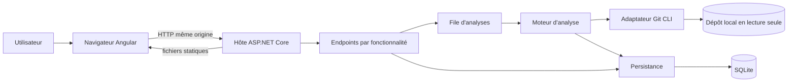

# Architecture technique de GitHealth
> Statut : MVP implémenté, release candidate `0.1.0-rc.1` — mise à jour : 29 août 2026
## Vue d'ensemble

GitHealth est une application web locale d'aide au diagnostic des branches Git.
L'utilisateur sélectionne un dépôt et une branche de référence, généralement
`main`, puis obtient une vue comparative de ses branches locales ou distantes.

L'application doit :

- fonctionner hors ligne, sans service externe obligatoire ;
- démarrer depuis un point d'entrée unique ;
- être distribuable sur Windows et macOS ;
- analyser les dépôts sans checkout et sans modifier leurs références ;
- conserver les configurations et les analyses dans une base SQLite exportable ;
- rester utilisable sur des dépôts comportant plusieurs centaines de branches.

Le produit est mono-utilisateur. L'interface Angular est servie par ASP.NET Core :
le navigateur ne communique donc qu'avec un seul processus et une seule origine.

## Périmètre fonctionnel

### MVP

- Enregistrer un dépôt déjà présent sur la machine.
- Détecter ses branches locales et ses branches de suivi distant.
- Choisir une référence et le jeu de branches à comparer.
- Calculer l'avance, le retard, la fusion et la dernière activité observable.
- Identifier les contributeurs des commits propres à une branche.
- Classer, filtrer et consulter le détail des branches.
- Configurer les seuils d'inactivité et les motifs de branches protégées.
- Conserver plusieurs analyses et exporter la base de données de façon cohérente.
- Fournir un exécutable natif et un lancement Docker Compose.

### Hors périmètre du MVP

- Supprimer, fusionner, checkout ou pousser une branche.
- Exécuter automatiquement `git fetch` ou `git remote prune`.
- Cloner un dépôt distant et gérer ses identifiants.
- Héberger une instance multi-utilisateur sur un réseau.
- Reconstituer avec certitude la création d'une branche ou ses checkouts passés.
- Remplacer les politiques de rétention propres à GitHub, GitLab ou Azure DevOps.

## Décisions structurantes

| Sujet | Décision | Conséquence |
|---|---|---|
| Interface | Application web locale Angular | Technologie maîtrisée et interface portable |
| Hôte | ASP.NET Core sert l'API et les fichiers Angular | Un processus, un port et une origine |
| Exécution principale | Exécutable .NET autonome | Accès direct aux dépôts du poste |
| Alternative | Docker Compose | Dépôts montés explicitement en lecture seule |
| Analyse Git | Client Git en ligne de commande | Sémantique Git sans checkout |
| Persistance | SQLite avec EF Core | Base locale, migrable et sauvegardable |
| État du front | Services Angular et Signals | Pas de store global externe pour le MVP |
| Tâches longues | File et service d'arrière-plan | API non bloquante et progression visible |
| Nettoyage | Recommandations seulement | GitHealth ne supprime jamais une branche |

## Sémantique Git

Une branche Git est une référence vers un commit. Git ne mémorise ni l'intention de
création de la branche, ni les checkouts effectués par les autres développeurs. Les
indicateurs d'usage sont donc des observations de l'historique, pas une mesure du
temps réellement passé sur la branche.

Pour une référence `R` et une branche `B` :

- **avance** : commits accessibles depuis `B` mais pas depuis `R` ;
- **retard** : commits accessibles depuis `R` mais pas depuis `B` ;
- **fusionnée** : le commit pointé par `B` est un ancêtre de `R` ;
- **activité** : date de commit du sommet de `B`, exprimée en UTC ;
- **contributeurs** : auteurs des commits de `R..B`, hors commits de fusion ;
- **nombre de commits propres** : identique à l'avance, sans compter tout
  l'historique hérité de la référence.

Les noms et adresses des auteurs respectent `.mailmap` lorsqu'il est présent. Sans
mailmap, une même personne utilisant plusieurs adresses peut apparaître plusieurs
fois.

Après la fusion complète d'une branche, `R..B` est vide. Git ne permet alors plus
d'attribuer avec certitude les commits à leur branche d'origine. GitHealth signale
l'attribution comme indisponible. Un snapshot antérieur reste consultable dans
l'historique, mais n'est jamais substitué aux faits de la nouvelle analyse.

Les données reflètent les références visibles localement au moment de l'analyse.
Sans `fetch`, elles peuvent différer de l'état actuel du serveur distant.

### États présentés

Les faits et leur interprétation restent séparés pour éviter un score opaque.

| Axe | Valeurs principales |
|---|---|
| Topologie | synchronisée, en avance, fusionnée/en retard, divergente, sans ancêtre commun |
| Activité | active, vieillissante, inactive, inconnue |
| Recommandation | conserver, examiner, candidate au nettoyage, exclue |

Valeurs initiales proposées, modifiables par projet :

- active jusqu'à 30 jours sans activité ;
- vieillissante de 31 à 90 jours ;
- inactive au-delà de 90 jours ;
- candidate au nettoyage uniquement si elle est fusionnée, inactive et non protégée ;
- à examiner si elle est inactive mais possède encore des commits propres.

Aucune recommandation ne déclenche une action Git.

## Stack technique

| Composant | Choix cible |
|---|---|
| Runtime et API | .NET 10 LTS, ASP.NET Core |
| Interface | Angular 22, TypeScript strict, composants standalone |
| Accès aux données | Entity Framework Core 10 |
| Base | SQLite |
| Analyse | Exécutable `git`, détection de capacités au démarrage |
| Contrat HTTP | JSON, Problem Details et OpenAPI |
| Conteneur | Image Linux multi-stage et Docker Compose |
| Tests | Tests .NET, tests Angular et scénarios Git d'intégration |

Les versions correctives sont verrouillées dans le dépôt et maintenues dans leur
branche majeure. Node.js utilise une version supportée par Angular 22, fixée par le
projet lors de son initialisation.

## Architecture globale



Le cœur métier ne dépend ni d'ASP.NET Core, ni d'Entity Framework Core, ni du
processus Git. Les interfaces d'entrée/sortie permettent de tester les règles avec
des données déterministes.

## Organisation des modules

```text
src/
├── App.GitHealth.Core/{Analysis,Branches,Common,Projects,Shared}/
├── App.GitHealth.Api/
│   ├── Features/{Projects,Analyses,Policies,Snapshots,Exports,Runtime,Security}/
│   └── {Git,Persistence,Hosting}/
└── App.GitHealth.Web/src/app/
    ├── core/
    └── features/{home,dashboard,branch-details,project-settings,analysis-history}/
tests/
├── App.GitHealth.Core.Tests/
├── App.GitHealth.Api.Tests/
├── App.GitHealth.Git.IntegrationTests/
└── App.GitHealth.E2E/
```

### `App.GitHealth.Core`

Contient les types métier, les règles de qualification, les contrats du scanner et
les cas d'usage. Il ne lance aucun processus et n'accède pas au disque.

### `App.GitHealth.Api`

Contient l'hôte, les endpoints, l'orchestration des analyses et les adaptateurs :
Git, SQLite, horloge et système de fichiers. Une séparation en projet
`Infrastructure` ne sera introduite que si la taille ou les dépendances le
justifient.

### `App.GitHealth.Web`

Contient l'application Angular. Son build de production est intégré aux fichiers
statiques publiés par l'API. Les fonctionnalités sont chargées par route.

## Modèle de données

### Agrégats persistés

**Project**

- identifiant, nom d'affichage et chemin canonique ;
- état d'accessibilité du chemin ;
- référence sélectionnée et espace de branches analysé ;
- seuils d'activité, exclusions et motifs protégés ;
- dates de création et de dernière modification, identifiant de la dernière analyse réussie.

**AnalysisRun**

- projet, référence et SHA de référence observés ;
- dates de début et de fin, état et progression ;
- version de Git observée pendant l'analyse ;
- message d'erreur synthétique en cas d'échec.

**BranchSnapshot**

- nom complet de référence, nom affiché et SHA ;
- avance, retard, état de fusion et état d'activité ;
- date du sommet, auteur du sommet et recommandation calculée ;
- indicateur d'exclusion et motifs de l'interprétation.

**ContributorSnapshot**

- snapshot de branche ;
- nom et adresse canonisés par mailmap ;
- nombre de commits propres hors fusions ;
- rang dans la branche.

Les snapshots sont immuables. Une analyse échouée ne remplace jamais la dernière
analyse réussie. Une branche recréée sous le même nom est distinguée dans
l'historique par la discontinuité de son SHA.

### SQLite

- clés étrangères activées ;
- mode WAL et délai d'attente configuré pour les écritures concurrentes ;
- migrations versionnées et appliquées au démarrage ;
- transactions courtes pendant la persistance d'un lot ;
- export réalisé par l'API de sauvegarde SQLite, pas par copie du fichier ouvert.

La base est portable, mais les chemins de dépôts ne le sont pas. Après import sur
une autre machine, les anciens snapshots restent consultables. L'utilisateur peut
relocaliser le projet vers le même dépôt : son identifiant et son historique sont
conservés après validation du nouveau chemin, de la référence configurée et du dernier
commit de référence connu. Une réservation par projet exclut toute analyse concurrente.

## Flux de données

### Enregistrement d'un projet

1. L'utilisateur saisit ou sélectionne un chemin.
2. L'API résout son chemin canonique et applique les racines autorisées.
3. L'adaptateur Git vérifie le dépôt, son répertoire Git et la version disponible.
4. Les références sont listées sans checkout.
5. L'utilisateur confirme la référence et les filtres de branches.
6. La configuration est persistée.

### Relocalisation d'un projet

1. L'utilisateur indique le nouveau chemin depuis les paramètres du projet.
2. L'API applique les mêmes contrôles de chemin et inspecte le dépôt en lecture seule.
3. La référence configurée doit encore exister et le chemin ne doit pas être déjà rattaché.
4. Seul le chemin du projet est remplacé ; ses analyses et son dernier snapshot restent liés.

### Analyse

1. `POST /api/projects/{id}/analyses` crée une exécution et renvoie `202 Accepted`.
2. La file refuse une seconde analyse simultanée du même projet.
3. Le scanner capture les SHA de départ pour obtenir un snapshot cohérent.
4. La topologie de toutes les branches est calculée et rendue disponible rapidement.
5. Les contributeurs sont enrichis en arrière-plan avec un parallélisme borné.
6. Les résultats sont persistés puis l'exécution passe à `Completed`.
7. Le front interroge l'état et recharge les données à chaque changement d'étape.

Si une référence change pendant le scan, l'analyse conserve les SHA capturés. Un
scan suivant reflétera le nouvel état.

### Stratégie de commandes Git

- Aucun shell : arguments fournis avec `ProcessStartInfo.ArgumentList`.
- Aucun checkout, index, commit, fetch, prune ou écriture de référence.
- `GIT_OPTIONAL_LOCKS=0`, délai maximal et annulation sur chaque processus.
- Sorties structurées avec séparateurs NUL lorsque Git le permet.
- Chemin rapide : `git for-each-ref` et l'atome `ahead-behind` calculent la
  topologie de plusieurs références en un processus.
- Repli pour les versions plus anciennes : `git rev-list --left-right --count`
  avec un parallélisme strictement borné.
- Enrichissement : `git shortlog`/`git log` sur `reference..branche`, mis en cache
  par couple de SHA et effectué à la demande ou en tâche de fond.

## API HTTP

Les routes sont groupées sous `/api` et renvoient des DTO dédiés.

| Méthode et route | Responsabilité |
|---|---|
| `GET /api/session` | Initialiser session locale et jeton anti-forgery |
| `GET /api/projects` | Lister les projets et leur dernier état |
| `POST /api/projects/validate` | Valider un chemin sans le persister |
| `POST /api/projects` | Enregistrer un projet |
| `PUT /api/projects/{id}/repository` | Relocaliser un dépôt en conservant l'historique |
| `PUT /api/projects/{id}/settings` | Modifier référence, seuils et exclusions |
| `POST /api/projects/{id}/analyses` | Démarrer une analyse |
| `GET /api/analyses/{id}` | Lire état et progression |
| `GET /api/projects/{id}/analyses/latest/branches` | Lister les snapshots |
| `GET /api/branch-snapshots/{id}` | Lire détail et contributeurs |
| `GET /api/exports/database` | Télécharger une sauvegarde SQLite cohérente |

Les erreurs utilisent Problem Details avec un code stable, un message utilisateur
et un identifiant de corrélation. Aucune sortie brute de processus n'est envoyée au
navigateur.

## Gestion de l'état et de la concurrence

- SQLite est la source de vérité des configurations et analyses terminées.
- La file et la progression des analyses sont détenues en mémoire par l'hôte.
- Un seul scan peut être actif par projet ; la concurrence globale est bornée.
- Le front utilise des services Angular et Signals par fonctionnalité.
- Les paramètres de filtre dans l'URL permettent de partager et restaurer une vue.
- Aucun NgRx n'est introduit tant qu'un besoin de coordination globale ne l'exige.
- Le front utilise un polling léger ; SignalR n'est pas requis pour le MVP.

## Déploiement et point d'entrée

### Exécutable natif, mode recommandé

La publication produit `githealth.exe` pour Windows et `githealth` pour macOS. Le
même processus :

1. vérifie Git et la base ;
2. écoute uniquement sur `127.0.0.1` ;
3. choisit un port disponible ou celui demandé ;
4. ouvre le navigateur par défaut ;
5. sert Angular et l'API jusqu'à son arrêt.

Options prévues : `--repo`, `--port`, `--data-dir` et `--no-browser`.

Emplacements par défaut :

- Windows : `%LOCALAPPDATA%\GitHealth` ;
- macOS : `~/Library/Application Support/GitHealth`.

Des publications autonomes sont générées pour les architectures retenues. La
signature Windows et la notarisation macOS sont des sujets de distribution, pas
des prérequis pour valider le MVP en développement.

### Docker Compose

`docker compose up --build` lance un service applicatif unique. L'image contient
le runtime .NET, les fichiers Angular et Git. Compose configure :

- `127.0.0.1:8080` comme exposition par défaut ;
- un volume persistant monté sous `/data` ;
- `${GITHEALTH_REPOSITORIES_ROOT}` monté sous `/repositories` en lecture seule.

Dans ce mode, seuls les dépôts inclus dans `/repositories` sont sélectionnables.
Changer la racine nécessite de recréer le conteneur avec une autre configuration.

## Sécurité

- Écoute loopback uniquement et aucune exposition réseau par défaut.
- Même origine, CORS désactivé et protection anti-requête intersite sur les mutations.
- Validation de `Host`/`Origin` et jeton de session local généré au démarrage.
- Canonicalisation des chemins et rejet des sorties de racine en mode Docker.
- Arguments Git transmis sans shell pour empêcher l'injection de commandes.
- Commandes Git autorisées par liste blanche, annulables et limitées en sortie.
- Dépôts Docker montés en lecture seule ; aucune API de suppression de branche.
- Échappement des noms de branche et d'auteur par Angular.
- Aucune télémétrie ni transmission d'adresses d'auteur par défaut.

La base contient potentiellement des noms et adresses professionnelles. Elle reste
locale et son export est une action explicite de l'utilisateur.

## Fiabilité et performance

- Une analyse travaille sur des SHA immuables capturés au départ.
- Les résultats incomplets restent attachés à leur exécution et ne deviennent pas
  le dernier snapshot réussi.
- Les processus Git ont un timeout, une annulation et une taille de sortie bornée.
- Les enrichissements sont mis en cache lorsque les SHA n'ont pas changé.
- Le tableau est paginé ou virtualisé pour ne pas rendre toutes les lignes à la fois.
- Un dépôt synthétique d'au moins 1 000 branches sert de benchmark reproductible.
- Les budgets de durée sont fixés d'après la première baseline Windows et surveillés
  séparément des mesures informatives exécutées sur d'autres plateformes.

## Stratégie de tests

- **Unitaires Core** : calcul des états, seuils, exclusions et cas limites.
- **Intégration Git** : dépôts temporaires avec branches synchronisées, avancées,
  fusionnées, divergentes, inactives et sans ancêtre commun.
- **Intégration API/SQLite** : migrations, transactions, concurrence et export.
- **Front** : composants, filtres, erreurs et accessibilité de base.
- **Bout en bout** : ajout d'un dépôt, analyse, consultation et redémarrage.
- **Non-régression lecture seule** : refs, index et worktree identiques avant/après.
- **Matrice** : Windows, macOS et conteneur Linux dans la CI disponible.

## Évolutions envisagées

- Clones miroirs gérés depuis une URL et actualisation distante explicite.
- Intégrations GitHub, GitLab et Azure DevOps pour les branches protégées et PR.
- Regroupement manuel d'identités en complément de `.mailmap`.
- Tendances d'activité, comparaison entre analyses et politiques par équipe.
- Exports CSV/JSON et rapports partageables sans exposer le dépôt.
- Signature/notarisation et installeurs graphiques pour les distributions publiques.

## Références techniques
- [Politique de support .NET](https://dotnet.microsoft.com/en-us/platform/support/policy)
- [Versions et support Angular](https://angular.dev/reference/releases)
- [Fournisseurs de base de données EF Core](https://learn.microsoft.com/en-us/ef/core/providers/)
- [Documentation `git for-each-ref`](https://git-scm.com/docs/git-for-each-ref)
- [Documentation `git rev-list`](https://git-scm.com/docs/git-rev-list)
- [Documentation `git log`](https://git-scm.com/docs/git-log)
