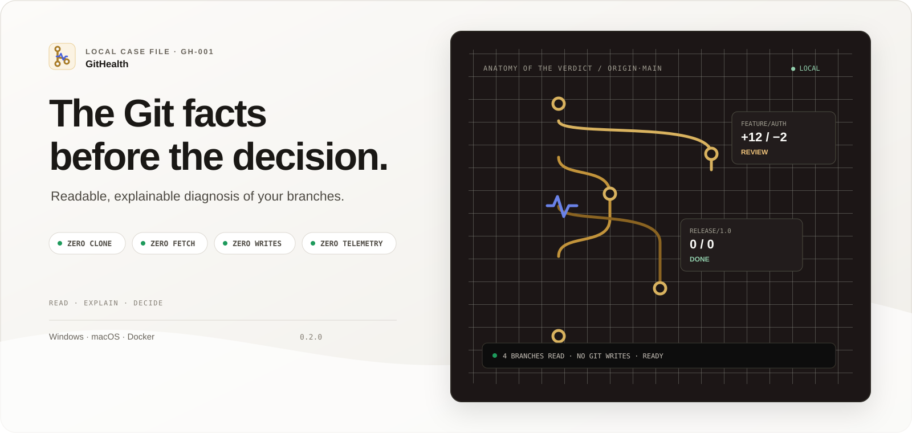
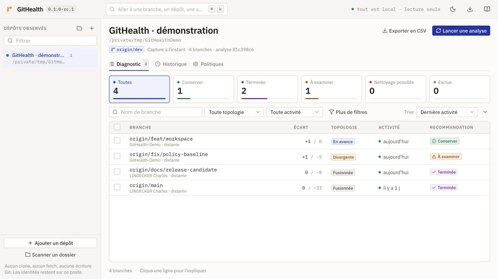

<p align="center">
  <picture>
    <source media="(prefers-color-scheme: dark)"
      srcset="docs/assets/readme/hero-dark.svg">
    <source media="(prefers-color-scheme: light)"
      srcset="docs/assets/readme/hero-light.svg">
    
  </picture>
</p>

<h1 align="center">GitHealth</h1>

<p align="center">
  <a href="https://github.com/LINDECKER-Charles/App.GitHealth/actions/workflows/ci.yml">
    
  </a>
  <a href="https://github.com/LINDECKER-Charles/App.GitHealth/actions/workflows/security.yml">
    
  </a>
  <a href="https://github.com/LINDECKER-Charles/App.GitHealth/releases/latest">
    
  </a>
  <a href="LICENSE">
    
  </a>
</p>

<p align="center">
  <strong>See which branches still matter — without touching the repository.</strong><br>
  Local by design · explainable by default · Windows, macOS, Linux and Docker
</p>

<p align="center">
  <a href="https://github.com/LINDECKER-Charles/App.GitHealth/releases/latest">
    <strong>Download GitHealth</strong>
  </a>
  &nbsp;·&nbsp;
  <a href="docs/USER_GUIDE.md">User guide</a>
  &nbsp;·&nbsp;
  <a href="docs/README.md">Documentation</a>
  &nbsp;·&nbsp;
  <a href="docs/ARCHITECTURE.md">Architecture</a>
</p>

---

GitHealth turns a branch history that is hard to read into decisions you can argue for.
It compares the references already present on the machine, measures their topology and
their activity, then explains why a branch should be kept, reviewed, or is probably
ready to be cleaned up.

It is neither a deletion bot nor yet another forge. It is a local diagnostic bench: the
facts stay visible, the policies stay under your control, and every Git action stays in
your hands.

> [!IMPORTANT]
> GitHealth never runs `clone`, `fetch`, `pull`, `checkout`, `merge`, `push` or any
> deletion. It modifies neither the references, nor the index, nor the worktree, nor the
> reflogs.

## 01 — One repository. Facts. A verdict you can read.

| Observe | Understand | Decide | Track |
|---|---|---|---|
| Ahead, behind, merge base and last commit | Topology, activity and normalised contributors | Keep, review or clean up — with the reason | Snapshots, history, CSV and SQLite backup |

<picture>
  <source media="(prefers-color-scheme: dark)"
    srcset="docs/assets/readme/diagnostic-dark.jpg">
  <source media="(prefers-color-scheme: light)"
    srcset="docs/assets/readme/diagnostic-light.jpg">
  
</picture>

<p align="center"><sub>Local scenario built from the GitHealth repository itself</sub></p>

Every row keeps the full chain of reasoning:

```text
Git facts  →  topology  →  activity  →  policy  →  recommendation + explanation
```

A diverged branch is therefore never merely "red". GitHealth shows how far apart it is,
when it was last active, which rule was applied, and the reason that justifies the
attention it asks for. When the facts are not enough, the interface says so instead of
inventing certainty.

## 02 — Built for a single repository and for a whole workspace

- analyse local or remote-tracking branches against the baseline of your choice;
- scan a folder, detect the repositories it contains and run several analyses in
  parallel;
- tell apart branches that are in sync, ahead, merged, diverged or with no merge base;
- spot recent, ageing or inactive branches using configurable thresholds;
- protect or exclude branches by pattern, with a preview before applying;
- explain a branch down to its detail panel: own commits, contributors and the reason
  behind the verdict;
- relocate a repository that has moved without losing its analysis history;
- filter, sort, compare snapshots and export the current view as CSV;
- install it as a desktop application, run it from a portable archive, or run it in a
  hardened container.

## 03 — Local is not a slogan, it is the product boundary

| GitHealth refuses to | Why | Documented evidence |
|---|---|---|
| Clone or refresh a remote | The diagnosis is about the state actually present on the machine | [Git isolation](docs/SECURITY_MODEL.md#git-isolation) |
| Write to the repository | Observation must never turn into mutation | [Read-only Git analysis](docs/DEVOPS.md#read-only-git-analysis) |
| Send telemetry | Identities and history stay local | [Outbound communication](docs/SECURITY_MODEL.md#privacy-and-outbound-communication) |
| Expose a network service | GitHealth is a local, single-user tool | [Trust boundary](docs/SECURITY_MODEL.md#purpose-and-trust-boundary) |

Git commands run without a shell, with a timeout, an output budget, bounded concurrency
and a neutralised environment. The interface and the API share one local origin; the
CSP, the session and the anti-forgery tokens reinforce that boundary. The release
pipeline produces SHA-256 checksums and an SPDX SBOM.

[Read the security model](docs/SECURITY_MODEL.md) ·
[Read the audit](docs/SECURITY_AUDIT.md) ·
[See the accepted limitations](docs/KNOWN_LIMITATIONS.md)

## 04 — Get started in minutes

### Desktop application — the recommended path

Download the installer from the
[latest release](https://github.com/LINDECKER-Charles/App.GitHealth/releases/latest):
`App.GitHealth-win-x64-Setup.exe` on Windows, `App.GitHealth-<rid>-Setup.pkg` on macOS.
It installs per user under `%LocalAppData%\App.GitHealth`, without a UAC prompt, with
Desktop and Start menu shortcuts.

On double-click, GitHealth opens a native window: the local server and the interface
live in the same process, and the "Browse" button opens the system folder dialog. Data
stays in `%LOCALAPPDATA%\GitHealth`, away from the installation: it survives both
updates and uninstallation. When a newer version is published, an "Update" button
appears in the top bar.

The .NET runtime is bundled; Git 2.38 or newer is recommended. Outside the `PATH` and
the usual installation locations, `--git-path <path>` points to the Git executable to
use.

> [!NOTE]
> The installers are neither signed nor notarised. SmartScreen and Gatekeeper may ask
> for explicit approval on first launch.

### Package managers

A Scoop manifest ships with every Windows release and installs the portable archive:

```powershell
# `/latest/` skips pre-releases: target the published version explicitly.
$version = "v0.1.0-rc.1"
$base = "https://github.com/LINDECKER-Charles/App.GitHealth/releases/download/$version"
scoop install "$base/githealth.json"
```

winget manifests are produced with each release, but submitting them to
`microsoft/winget-pkgs` is still pending: `winget install` is not available yet.

### Portable archives

For a machine where nothing should be installed: download `githealth-win-x64.zip`,
`githealth-osx-x64.tar.gz`, `githealth-osx-arm64.tar.gz` or
`githealth-linux-x64.tar.gz`, then run the executable from any directory:

```powershell
# Windows x64
C:\Applications\GitHealth\githealth.exe --repo D:\Dev\MyRepository
```

```shell
# macOS Intel or Apple Silicon
/Applications/GitHealth/githealth --repo "$HOME/Dev/MyRepository"
```

The launcher picks a free port on `127.0.0.1` and opens the same native window;
`--no-window` uses the system browser instead. On Linux the window depends on WebKitGTK:
without it, GitHealth falls back to the browser. There is no in-app update outside the
Windows and macOS installers.

### Docker Compose — self-hosting

The container does not target the developer workstation: it runs GitHealth on a machine
you administer. No window, no in-app update, and repositories must be mounted
explicitly.

```shell
cp .env.example .env
# Set GITHEALTH_REPOSITORIES_HOST_PATH in .env
docker compose up --build
```

GitHealth then answers on `http://127.0.0.1:8080`. Repositories are mounted read-only;
only `/data` and `/tmp` remain writable inside the container.

### From source

```shell
git clone https://github.com/LINDECKER-Charles/App.GitHealth.git
cd App.GitHealth

./eng/build.sh check      # macOS, Linux — the local toolchain
./eng/build.sh publish    # the application, as it is distributed
./eng/build.sh run
```

On Windows, `eng\build.cmd` replaces `./eng/build.sh`; everything else is identical.
The five build levels, the prerequisites per operating system and what can or cannot be
built for another system are detailed in [eng/README.md](eng/README.md).

The day-to-day development loop and the contribution conventions live in
[CONTRIBUTING.md](.github/CONTRIBUTING.md).

## 05 — Documentation organised by intent

| I want to… | Entry point |
|---|---|
| get started with GitHealth | [User guide](docs/USER_GUIDE.md) |
| understand the technical choices | [Architecture](docs/ARCHITECTURE.md) |
| install, release or operate it | [DevOps guide](docs/DEVOPS.md) |
| fix a startup problem | [Troubleshooting](docs/TROUBLESHOOTING.md) |
| know exactly where the trust boundary is | [Security model](docs/SECURITY_MODEL.md) |
| measure or reproduce performance | [Benchmarks](docs/BENCHMARKING.md) |
| contribute properly | [Contribution guide](.github/CONTRIBUTING.md) |
| browse the whole documentation | [Documentation hub](docs/README.md) |

## 06 — A deliberately simple foundation

```text
Angular 22  ──local HTTP──▶  ASP.NET Core 10  ──▶  pure C# domain
                                     │
                                     ├──▶  bounded, read-only Git processes
                                     └──▶  SQLite · projects, policies, snapshots
```

The domain core depends neither on Git, nor on Entity Framework, nor on the web. The API
orchestrates reads and persistence; Angular presents the facts and keeps filters
shareable through the URL. Tests cover the domain, the API, real Git repositories, the
Docker infrastructure and the browser journey.

[Explore the full architecture](docs/ARCHITECTURE.md) ·
[Read the benchmark results](docs/benchmarks/windows-initial.md)

## 07 — Project status

The version being prepared is **`0.1.0-rc.1`**. It includes the desktop application with
its Windows and macOS installers, the Windows, macOS and Linux portable archives, the
Scoop manifest, Docker Compose, CI qualification, a security audit and a performance
baseline up to 1,000 branches. The project is still a release candidate: the
[known limitations](docs/KNOWN_LIMITATIONS.md) are part of the public contract — no code
signing or notarisation, no in-app update on Linux, and Git still has to be installed
separately.

Contributions are welcome. Start with
[CONTRIBUTING.md](.github/CONTRIBUTING.md), read the
[code of conduct](.github/CODE_OF_CONDUCT.md), and use the private channel described in
[SECURITY.md](.github/SECURITY.md) for any vulnerability.

---

<p align="center">
  <strong>GitHealth observes. You keep the decision.</strong><br>
  <sub>Distributed under the <a href="LICENSE">MIT</a> license.</sub>
</p>
