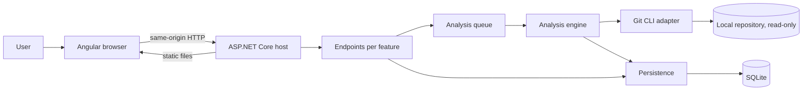

# GitHealth technical architecture
> Status: MVP implemented, published version `0.1.0` — updated: 2 September 2026
## Overview

GitHealth is a local web application that helps diagnose Git branches. The user selects a
repository and a baseline branch, usually `main`, then gets a comparative view of its
local or remote branches.

The application must:

- work offline, with no mandatory external service — the sole exception being the local
  agent assistant, which is allowed per repository and removable for an installation;
- start from a single entry point;
- be distributable on Windows and macOS;
- analyse repositories without a checkout and without modifying their references;
- keep configurations and analyses in an exportable SQLite database;
- stay usable on repositories with several hundred branches.

The product is single-user. The Angular interface is served by ASP.NET Core: the browser
therefore talks to a single process and a single origin.

## Functional scope

### MVP

- Register a repository already present on the machine.
- Detect the repositories in a folder and analyse several of them at once.
- Detect its local branches and its remote-tracking branches.
- Choose a baseline and the set of branches to compare.
- Compute ahead, behind, merge state and the last observable activity.
- Identify the contributors of the commits specific to a branch.
- Sort, filter and inspect the detail of branches.
- Configure inactivity thresholds and protected branch patterns.
- Keep several analyses and export the database consistently.
- Let an agent CLI already installed on the machine query a stored capture, and keep the
  conversation that follows.
- Provide a native executable and a Docker Compose launch.

### Outside the MVP scope

- Delete, merge, check out or push a branch.
- Install, update or authenticate an agent CLI, or call a model provider directly.
- Let an agent reach the repository, or any path other than its own scratch directory.
- Automatically run `git fetch` or `git remote prune`.
- Clone a remote repository and manage its credentials.
- Host a multi-user instance on a network.
- Reconstruct with certainty the creation of a branch or its past checkouts.
- Replace the retention policies specific to GitHub, GitLab or Azure DevOps.

## Structural decisions

| Topic | Decision | Consequence |
|---|---|---|
| Interface | Local Angular web application | Familiar technology and a portable interface |
| Host | ASP.NET Core serves the API and the Angular files | One process, one port and one origin |
| Main execution | Self-contained .NET executable | Direct access to the machine's repositories |
| Alternative | Docker Compose | Repositories mounted read-only and explicitly |
| Desktop shell | Photino inside the host process | No child process to supervise |
| Distribution | Velopack, per-user installation | No UAC, data outside the installation |
| Git analysis | Git command-line client | Git semantics without a checkout |
| Persistence | SQLite with EF Core | A local database, migratable and backupable |
| Front-end state | Angular services and Signals | No external global store for the MVP |
| Long-running tasks | Queue and background service | Non-blocking API and visible progress |
| Cleanup | Recommendations only | GitHealth never deletes a branch |
| Agent assistant | An agent CLI already installed, driven headless | The user's own tool and account, no key to hold |
| Agent input | A read-only tool bridge over a stored capture | The agent queries measurements; it never opens the repository |
| Agent bridge | Streamable-HTTP MCP on the host's own loopback port | Nothing new listens, and the route lives outside `/api` |
| Agent authorisation | One 256-bit token per run, closed when it settles | A capture is reachable only while its run is alive |
| Agent sandbox | Empty scratch directory, the CLI's read-only mode | The read-only guarantee survives a foreign process |
| Assistant history | Conversations in SQLite, cascading from the capture | A record the user can read, export and delete |
| Assistant consent | A moment stored on the project, checked by the API | The screen asks; the API is what refuses |

## Git semantics

A Git branch is a reference to a commit. Git remembers neither the intent behind the
branch's creation nor the checkouts performed by other developers. Usage indicators are
therefore observations of the history, not a measure of the time actually spent on the
branch.

For a baseline `R` and a branch `B`:

- **ahead**: commits reachable from `B` but not from `R`;
- **behind**: commits reachable from `R` but not from `B`;
- **merged**: the commit `B` points at is an ancestor of `R`;
- **activity**: commit date of the tip of `B`, expressed in UTC;
- **contributors**: authors of the commits in `R..B`, merge commits excluded;
- **own commit count**: identical to ahead, without counting all the history inherited
  from the baseline.

Author names and addresses honour `.mailmap` when it is present. Without a mailmap, one
person using several addresses can appear several times.

After a branch has been fully merged, `R..B` is empty. Git then no longer allows commits
to be attributed to their branch of origin with certainty. GitHealth reports the
attribution as unavailable. An earlier snapshot stays visible in the history, but is
never substituted for the facts of the new analysis.

The data reflects the references visible locally at the time of the analysis. Without a
`fetch`, it may differ from the current state of the remote server.

### States presented

Facts and their interpretation stay separate, to avoid an opaque score.

| Axis | Main values |
|---|---|
| Topology | in sync, ahead, merged/behind, diverged, no common ancestor |
| Activity | active, ageing, inactive, unknown |
| Recommendation | keep, review, cleanup candidate, excluded |

Initial values, adjustable per project:

- active up to 30 days without activity;
- ageing from 31 to 90 days;
- inactive beyond 90 days;
- cleanup candidate only if merged, inactive and not protected;
- review if inactive but still carrying its own commits.

No recommendation ever triggers a Git action.

## Technical stack

| Component | Target choice |
|---|---|
| Runtime and API | .NET 10 LTS, ASP.NET Core |
| Interface | Angular 22, strict TypeScript, standalone components |
| Data access | Entity Framework Core 10 |
| Database | SQLite |
| Analysis | The `git` executable, capability detection at startup |
| HTTP contract | JSON, Problem Details and OpenAPI |
| Container | Multi-stage Linux image and Docker Compose |
| Desktop shell | Photino.NET 4.0.16 |
| Installer and updates | Velopack 1.2.0 |
| Tests | .NET tests, Angular tests and Git integration scenarios |

Photino embeds the system rendering engine inside the host process: the window and
Kestrel share a lifecycle, with no child-process supervision and no port handshake.
Velopack produces a per-user installer and delta packages from the GitHub release feed
that CI already publishes.

Patch versions are pinned in the repository and maintained within their major branch.
Node.js uses a version supported by Angular 22, fixed by the project at initialisation.

## Global architecture



The domain core depends neither on ASP.NET Core, nor on Entity Framework Core, nor on the
Git process. The input/output interfaces make it possible to test the rules with
deterministic data.

## Module layout

```text
src/
├── App.GitHealth.Core/{Analysis,Branches,Common,Projects,Shared}/
├── App.GitHealth.Api/
│   ├── Features/{Projects,Analyses,Discovery,Policies,Snapshots,Exports,Runtime,Security,Updates}/
│   ├── Features/Assistant/{Agents,Conversations,Mcp}/
│   └── {Git,Persistence,Hosting,Hosting/Desktop}/
└── App.GitHealth.Web/src/app/
    ├── core/{api,assistant,branches,desktop,markdown,scan,updates,workspace}/
    └── features/{home,dashboard,branch-details,project-settings,analysis-history,assistant}/
tests/
├── App.GitHealth.Core.Tests/
├── App.GitHealth.Api.Tests/
├── App.GitHealth.Git.IntegrationTests/
└── App.GitHealth.E2E/
```

### `App.GitHealth.Core`

Holds the domain types, the qualification rules, the scanner contracts and the use cases.
It starts no process and does not touch the disk.

### `App.GitHealth.Api`

Holds the host, the endpoints, the orchestration of analyses and the adapters: Git,
SQLite, clock and file system. A separate `Infrastructure` project will only be
introduced if size or dependencies justify it.

`Hosting/Desktop/` carries the desktop shell: window, display mode resolution and the
message bridge. `Features/Updates/` carries the update state and its application.

### `App.GitHealth.Web`

Holds the Angular application. Its production build is bundled into the static files
published by the API. Features are loaded per route.

The interface applies the Établi design system, whose tokens and `.etb-*` classes live in
`src/styles/ds/`. Its primitives are reimplemented as standalone Angular components under
`src/app/ui/`, and its fonts and glyphs are served locally from `public/ds/`. The
application therefore loads no remote resource.

Critical CSS inlining is disabled in production: the content security policy forbids
inline scripts, and the `onload` handler it generates would not run.

## Data model

### Persisted aggregates

**Project**

- identifier, display name and canonical path;
- reachability state of the path;
- analysed branch space;
- activity thresholds, exclusions and protected patterns;
- creation and last modification dates, identifier of the last successful analysis;
- `AssistantConsentAtUtc`: the moment sending this repository's captures to an agent was
  allowed, null while it never was. Nullable, so every repository predating the column starts
  with no permission granted.

**ProjectBaseline**

- project and reference name, which together identify the baseline;
- position in the list — position `0` is the primary baseline, the one shown by default;
- identifier of the last successful analysis *of that baseline*.

A project compares itself against as many baselines as it declares, up to eight. Each one
keeps its own history, so `dev`, `test` and `main` are read independently rather than
overwriting one another. The baseline is identified by its name, which is why reordering the
list never detaches a baseline from the captures already taken against it.

**AnalysisRun**

- project, baseline and baseline SHA observed;
- start and end dates, state and progress;
- Git version observed during the analysis;
- summary error message on failure.

**BranchSnapshot**

- full reference name, display name and SHA;
- ahead, behind, merge state and activity state;
- tip date, tip author and computed recommendation;
- exclusion flag and the reasons behind the interpretation.

**ContributorSnapshot**

- branch snapshot;
- name and address canonicalised by mailmap;
- number of own commits excluding merges;
- rank within the branch.

**AssistantConversation**

- analysis run read — *not* the project: a thread is only meaningful next to the
  measurements it argued about, so the foreign key cascades and deleting a capture deletes
  the conversations about it;
- identifier and display name of the agent that last answered;
- title, which is the first question shortened to 300 characters;
- number of branches the agent could read, so a stored answer keeps the scale it was given;
- started and last updated dates.

**AssistantMessage**

- conversation and position in it — timestamps collide, positions do not, and the pair is
  unique;
- role, `user` or `agent`, and the text as it was typed or as it was written;
- on an agent turn only: status, effort, the command line with its bridge token blanked,
  failure code and message, duration and whether the answer was cut short.

Both tables come from `20260902163530_AddAssistantConversations`, which also adds
`Projects.AssistantConsentAtUtc`. A question and its answer are written together, once the
run has settled, whichever way it settled — a refusal and a stop are part of a repository's
history too. That write never fails a run: the answer is already on screen, so a history
that could not be kept is a log line rather than an error.

Snapshots are immutable. A failed analysis never replaces the last successful analysis. A
branch recreated under the same name is distinguished in the history by the discontinuity
of its SHA.

### SQLite

- foreign keys enabled;
- WAL mode and a configured timeout for concurrent writes;
- versioned migrations applied at startup;
- short transactions while persisting a batch;
- export performed through the SQLite backup API, not by copying an open file.

The database is portable, but repository paths are not. After importing on another
machine, the old snapshots stay readable. The user can relocate the project onto the same
repository: its identifier and its history are preserved once the new path, the configured
baseline and the last known baseline commit have been validated. A per-project
reservation rules out any concurrent analysis.

## Data flows

### Registering a project

1. The user types or selects a path.
2. The API resolves its canonical path and applies the allowed roots.
3. The Git adapter checks the repository, its Git directory and the available version.
4. References are listed without a checkout.
5. The user confirms the baseline and the branch filters.
6. The configuration is persisted.

### Discovering the repositories in a folder

1. The user provides a folder and an exploration depth.
2. The API applies the allowed roots, then walks the tree breadth-first.
3. A folder recognised as a repository — `.git`, a worktree `.git` file, or a bare
   layout — stops the descent: its submodules are not offered separately.
4. Hidden folders and build folders are skipped; the number of results is bounded and
   truncation is reported.
5. Each candidate is confirmed by a read-only Git call, with bounded parallelism; an
   unreadable folder is dropped from the result.
6. Repositories already attached to a project are returned with its identifier.

The front end registers the retained repositories that are not yet known, then starts one
analysis per repository. The analysis queue remains the sole master of the pace: a
repository rejected because the queue was full is retried as soon as a slot frees up.

### Relocating a project

1. The user provides the new path from the project settings.
2. The API applies the same path controls and inspects the repository read-only.
3. Every configured baseline must still exist and the path must not already be attached. A
   partial match is refused, because it would orphan one baseline's whole history.
4. Only the project's path is replaced; its analyses and its last snapshot stay attached.

### Analysis

1. `POST /api/projects/{id}/analyses` creates one run per declared baseline and returns
   `202 Accepted`. `?baseline=` restricts the launch to a single one.
2. The queue refuses a second simultaneous analysis of the same *baseline*; the baselines of
   one project are separate measurements and run independently.
3. The scanner captures the starting SHAs to obtain a consistent snapshot.
4. The topology of every branch is computed and made available quickly.
5. Contributors are enriched in the background with bounded parallelism.
6. The results are persisted, then the run moves to `Completed`.
7. The front end polls the state and reloads the data at every phase change.

If a reference changes during the scan, the analysis keeps the captured SHAs. A later
scan will reflect the new state.

### Asking an agent, and the bridge it reads through

1. `POST /api/projects/{id}/assistant/runs` resolves the agent from the catalog — only a
   catalog identifier resolves to an executable, so no caller can name a command — then the
   effort against what that agent declares, then the capture of the requested baseline.
2. The project's consent is read from that capture. Without it the run is refused with `403`
   and `assistant.consent_required`, before any process exists.
3. The bridge opens a session: a 256-bit token, the capture it is bound to, and an address
   built from the port Kestrel reports it is bound to. It opens *before* the process starts,
   so the agent's first tool call cannot race the session that authorises it.
4. The command line is materialised from the catalog entry, with the bridge address inlined —
   as a `--mcp-config` JSON document for Claude Code, as a `-c mcp_servers=…` override for
   Codex — and the token never lands in a file.
5. The process starts in an empty scratch directory, with the prompt on standard input. That
   prompt is the brief, the tool list, the rules and the question: the capture is not in it.
6. The agent calls back over `POST /agent-bridge/{token}`. Each call is answered from the
   capture already held in the session — no database read, no Git call, and no parameter
   naming a project, so a call cannot widen what it sees.
7. Its standard output is read line by line as it arrives. Both CLIs are launched in their
   JSON mode — `--output-format stream-json` for Claude Code, `--json` for Codex — so what
   would have been a human log is read into steps the panel narrates: waiting on the model,
   thinking, a tool call with the arguments it chose, writing. Nothing is retained of that
   stream beyond the steps and the answer, and the steps live with the run rather than with
   the conversation.
8. The run settles. The bridge session is closed, the scratch directory is deleted, and the
   exchange is written to the conversation — the question and the answer, not the steps.

The bridge speaks the subset of JSON-RPC the two supported CLIs use — `initialize`,
`tools/list`, `tools/call`, `ping`, `resources/list`, `prompts/list` — and refuses anything
else by name rather than answering it with something plausible. A notification carries no
reply and is answered `202`. `GET` on the route is `405`: this server never pushes. A tool
refusal travels as a result rather than as a protocol error, so the agent can read it,
correct itself and call again.

Its four tools — `get_capture`, `list_branches`, `get_branch`, `count_branches` — read a
capture and nothing else. There is deliberately no tool that runs Git, reaches the file
system or writes. `list_branches` pages with `skip` and `take`, 50 by default and 500 at
most, and an unknown filter value matches nothing rather than falling back to everything: an
agent notices an empty page, a silent fallback it would not.

### Git command strategy

- Executable resolved once at startup, first hit wins: configured path (`--git-path` or
  `GitHealth:Git:ExecutablePath`), then the `PATH`, then the platform's standard
  installation locations.
- No shell: arguments passed through `ProcessStartInfo.ArgumentList`.
- No checkout, index, commit, fetch, prune or reference write.
- `GIT_OPTIONAL_LOCKS=0`, a maximum duration and cancellation on every process.
- Structured output with NUL separators wherever Git allows it.
- Fast path: `git for-each-ref` and the `ahead-behind` atom compute the topology of many
  references in a single process.
- Fallback for older versions: `git rev-list --left-right --count` with strictly bounded
  parallelism.
- Enrichment: `git shortlog`/`git log` on `baseline..branch`, cached per SHA pair and
  performed on demand or in the background.

## HTTP API

Routes are grouped under `/api` and return dedicated DTOs.

| Method and route | Responsibility |
|---|---|
| `GET /api/session` | Initialise the local session and the anti-forgery token |
| `GET /api/projects` | List the projects and their latest state |
| `POST /api/projects/validate` | Validate a path without persisting it |
| `POST /api/repositories/discover` | Detect the repositories contained in a folder |
| `POST /api/projects` | Register a project |
| `PUT /api/projects/{id}/repository` | Relocate a repository while keeping its history |
| `PUT /api/projects/{id}/settings` | Change the baseline, thresholds and exclusions |
| `PUT /api/projects/{id}/organization` | Mark as favourite and move into a group |
| `DELETE /api/projects/{id}` | Forget a project and every capture taken of it |
| `GET /api/projects/{id}/baselines` | List the comparison baselines and their latest capture |
| `PUT /api/projects/{id}/baselines` | Replace the ordered baseline list |
| `POST /api/projects/{id}/analyses` | Start an analysis, one run per baseline |
| `GET /api/analyses/{id}` | Read state and progress |
| `DELETE /api/analyses/{id}` | Delete one capture and its measurements |
| `GET /api/projects/{id}/analyses/latest/branches` | List the snapshots |
| `GET /api/branch-snapshots/{id}` | Read the detail and its contributors |
| `GET /api/exports/database` | Download a consistent SQLite backup |
| `GET /api/updates` | Read the application update state |
| `POST /api/updates/apply` | Download then apply the available update |
| `GET /api/assistant/agents` | List the agent CLIs found, their versions and effort levels |
| `GET /api/projects/{id}/assistant/briefing` | The capture as text, shown before anything is allowed |
| `POST /api/projects/{id}/assistant/runs` | Start a run, optionally continuing a conversation |
| `GET /api/assistant/runs/{id}` | Read a run: its steps, and the answer since `?from=` |
| `POST /api/assistant/runs/{id}/cancel` | Stop a run in flight |
| `GET /api/projects/{id}/assistant/status` | Consent moment and number of stored conversations |
| `PUT /api/projects/{id}/assistant/consent` | Grant or withdraw the permission for a repository |
| `GET /api/projects/{id}/assistant/conversations` | The threads of a repository, every baseline |
| `DELETE /api/projects/{id}/assistant/conversations` | Empty that history, reporting how many went |
| `GET /api/assistant/conversations/{id}` | Read one thread, messages in order |
| `DELETE /api/assistant/conversations/{id}` | Delete one thread |

One route deliberately sits outside `/api`: `POST /agent-bridge/{token}`, the tool bridge an
agent reads a capture through. `/api` is the browser's prefix — it rejects a foreign origin
and a cross-site `Sec-Fetch-Site` context, and every mutation on it must carry the session
cookie and the anti-forgery token. A command-line agent has none of those, and relaxing the
guard for one route would relax it for the browser too. The bridge authorises on its
single-run token instead, and the loopback `Host` check still applies to it like it does to
everything else the host serves. It is excluded from the OpenAPI description: it is not part
of the public contract.

`GET /api/runtime` describes the execution mode. It also exposes Git availability, the
executable path that was selected and an actionable diagnostic: without Git, the
interface shows a banner naming the locations tried and `--git-path`, instead of failing
on the first scan.

The update state is `Unsupported`, `UpToDate`, `Unknown` or `Available`. It is
`Unsupported` outside a managed installation — Docker, portable archive, running from the
publish folder — and on Linux, where the user expects their package manager. It is
`Unknown` when the release source is unreachable: offline, rate-limited or repository
unavailable, with neither an error nor a loss of function. The update button appears in
the top bar only when the state is `Available`.

Errors use Problem Details with a stable code, a user-facing message and a correlation
identifier. No raw process output is ever sent to the browser.

## State and concurrency management

- SQLite is the source of truth for configurations and completed analyses.
- The analysis queue and progress are held in memory by the host.
- Only one scan can be active per project; global concurrency is bounded.
- `AnalysisQueue:MaximumParallelAnalyses` sets the number of queue readers, and therefore
  the number of analyses running at once. At `1`, the queue becomes strictly sequential
  again.
- The front end uses Angular services and Signals, per feature.
- Filter parameters in the URL make a view shareable and restorable.
- No NgRx is introduced until a global coordination need requires it.
- The front end uses light polling; SignalR is not required for the MVP.

## Deployment and entry point

### Native executable, the recommended mode

Publishing produces `githealth.exe` on Windows and `githealth` on macOS and Linux. The
same process:

1. checks Git and the database;
2. listens on `127.0.0.1` only;
3. picks an available port, or the requested one;
4. opens a desktop window embedding the system rendering engine;
5. serves Angular and the API until the window is closed.

The shell is provided by Photino: WebView2 on Windows, WKWebView on macOS and WebKitGTK
on Linux. The front end is not embedded, it stays loaded over HTTP from the loopback
address — the shell is therefore an isolated and replaceable component.

| Invocation | Interface opened |
|---|---|
| default, native mode | Desktop window |
| `--no-window` | No window, system browser |
| `--no-browser` | No interface; implies `--no-window` |
| container mode | Unchanged, the host runs on its own |

The window opens maximised. Photino sizes in physical pixels: on a display scaled to
150 %, the 1360 pixels of the restore size are only 907 CSS pixels, below the workspace's
minimum width of 1180 px. A fixed size therefore does not guarantee that width. The
restore size is 1360×860, the minimum size 960×600.

The window opens from the process's main thread, marked `[STAThread]`: top-level
statements would leave it in an MTA apartment, where WebView2 initialises without ever
rendering the page. macOS requires the same thread for its event loop.

The executable is a windowed-subsystem program: on double-click it does not open a console
next to its window, whose closing would stop the application. Windows then attaches no
console either when it is launched from a terminal, which would make the help and the
diagnostics silent: startup therefore attaches to the calling process's console, except
when standard output is already inherited — a redirection, like the smoke test's, must
never be replaced. The application icon is embedded in the executable, from where the
file explorer, the Start menu and the shortcuts created by the installer pick it up.

If the system rendering engine is unusable, the host writes a warning on `stderr` and
falls back to the system browser: the application never stops for lack of a webview.

Options: `--repo`, `--port`, `--data-dir`, `--git-path`, `--no-window` and
`--no-browser`.

Default locations:

- Windows: `%LOCALAPPDATA%\GitHealth`;
- macOS: `~/Library/Application Support/GitHealth`;
- Linux: `$XDG_DATA_HOME/GitHealth`, falling back to `~/.local/share/GitHealth`.

Self-contained publications are generated for the selected architectures.

### Message bridge with the shell

In window mode, the folder selection button opens the system dialog. The page and the
host exchange messages over Photino's `postMessage` bridge:
`window.external.sendMessage` to emit, `window.external.receiveMessage` to receive.

- JSON payloads: `{ id, kind }` on request, `{ id, kind, path }` on response, with `path`
  being `null` when the user cancels.
- `kind` is `pickFolder`; any other message is silently ignored on both sides.
- The bridge is asynchronous: every response carries its request identifier, and only one
  request is ever in flight since the dialog is modal.
- The host's handler runs on the window thread, the one pumping the event loop: the
  dialog opens with neither marshalling nor deadlock.
- Whatever comes from the webview is untrusted input: an unreadable message is discarded,
  never treated as a command.

On the Angular side the addition is strictly additive. The service detects the presence of
the bridge and uses it when it exists; otherwise the application keeps the HTML folder
browser served by `GET /api/runtime/directories`. Browser and Docker modes are unchanged.

### Installation and updates

Velopack produces `App.GitHealth-win-x64-Setup.exe` on Windows and
`App.GitHealth-<rid>-Setup.pkg` on macOS. Installation is per user under
`%LocalAppData%\App.GitHealth`, without a UAC prompt, with Desktop and Start menu
shortcuts. The `packId` is deliberately disjoint from the data directory: the database
stays in `%LOCALAPPDATA%\GitHealth` and survives both updates and uninstallation.

The portable `.zip` and `.tar.gz` archives are still published alongside the installers:
they serve Scoop and machines where nothing should be installed. Neither the `Setup.exe`
nor the `.pkg` is signed to date.

### Docker Compose, self-hosting

This mode targets self-hosting an instance, not desktop usage. `docker compose up --build`
starts a single application service. The image contains the .NET runtime, the Angular
files and Git. Compose configures:

- `127.0.0.1:8080` as the default exposure;
- a persistent volume mounted under `/data`;
- `${GITHEALTH_REPOSITORIES_ROOT}` mounted read-only under `/repositories`.

In this mode, only repositories included in `/repositories` can be selected. Changing the
root requires recreating the container with a different configuration.

## Security

- Loopback listening only, and no network exposure by default.
- Same origin, CORS disabled and cross-site request protection on mutations.
- `Host`/`Origin` validation and a local session token generated at startup.
- Path canonicalisation and rejection of root escapes in Docker mode.
- Git arguments passed without a shell, to prevent command injection.
- Git commands allowed by allowlist, cancellable and bounded in output.
- Docker repositories mounted read-only; no branch deletion API.
- Branch and author names escaped by Angular.
- No telemetry and no transmission of author addresses by default.
- The agent bridge is reachable only with a single-run token, on loopback, for the length of
  one run, and serves four read-only questions about one capture.
- Sending a repository's captures to an agent requires a permission stored on the project and
  checked by the API; the stored conversations are readable and deletable from the interface.

The database potentially contains names and business addresses — and, once the assistant has
been used, the questions asked and the answers given. It stays local, and exporting it is an
explicit user action.

## Reliability and performance

- An analysis works on immutable SHAs captured at the start.
- Incomplete results stay attached to their run and never become the last successful
  snapshot.
- Git processes have a timeout, cancellation and a bounded output size.
- Enrichments are cached when the SHAs have not changed.
- The table is paginated or virtualised so that not every row is rendered at once.
- A synthetic repository of at least 1,000 branches serves as a reproducible benchmark.
- Duration budgets are set from the first Windows baseline and monitored separately from
  the informative measurements run on other platforms.

## Test strategy

- **Core unit tests**: state computation, thresholds, exclusions and edge cases.
- **Git integration**: temporary repositories with branches that are in sync, ahead,
  merged, diverged, inactive and without a common ancestor.
- **API/SQLite integration**: migrations, transactions, concurrency and export.
- **Front end**: components, filters, errors and basic accessibility.
- **End to end**: adding a repository, analysis, browsing and restart.
- **Read-only regression**: refs, index and worktree identical before/after.
- **Matrix**: Windows, macOS and the Linux container in the available CI.

## Possible future work

- Managed mirror clones from a URL and explicit remote refresh.
- GitHub, GitLab and Azure DevOps integrations for protected branches and PRs.
- Manual identity grouping to complement `.mailmap`.
- Activity trends, comparison between analyses and per-team policies.
- CSV/JSON exports and shareable reports that do not expose the repository.
- Windows signing and macOS notarisation of the installers, unsigned today.

## Technical references
- [.NET support policy](https://dotnet.microsoft.com/en-us/platform/support/policy)
- [Angular versions and support](https://angular.dev/reference/releases)
- [EF Core database providers](https://learn.microsoft.com/en-us/ef/core/providers/)
- [`git for-each-ref` documentation](https://git-scm.com/docs/git-for-each-ref)
- [`git rev-list` documentation](https://git-scm.com/docs/git-rev-list)
- [`git log` documentation](https://git-scm.com/docs/git-log)
